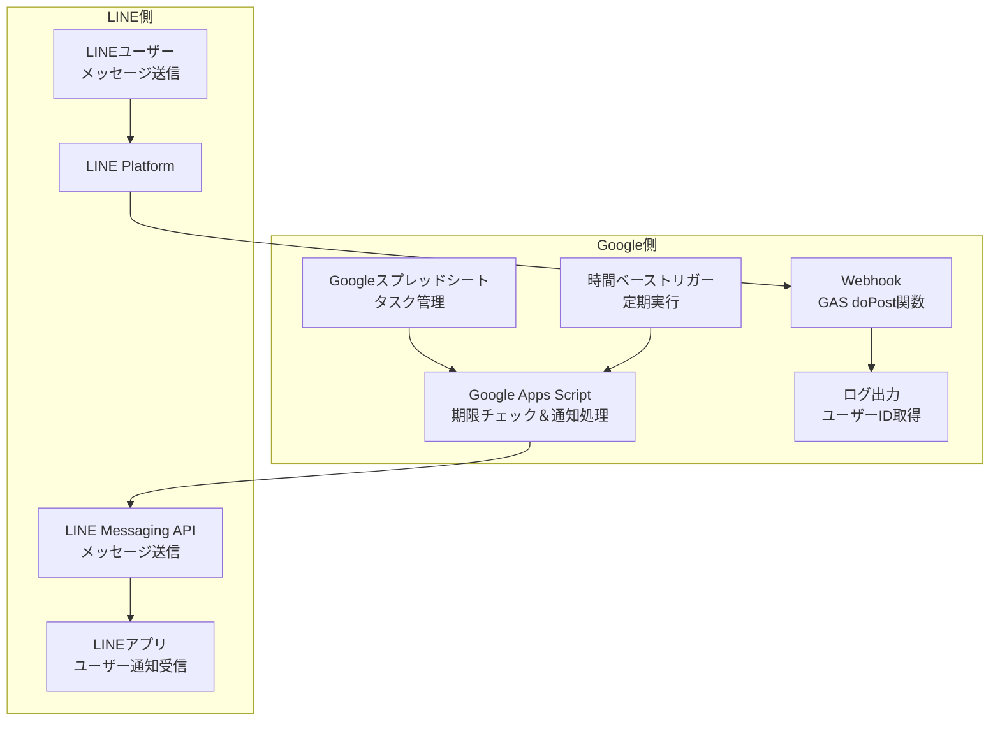

# gas-task-reminder-for-line

LINEでタスクリマインダー機能を提供するGoogle Apps Scriptライブラリです。

## 特徴
- LINEユーザーのタスク管理機能
- 指定した時間でのリマインダー通知
- シンプルで直感的なインターフェイス
- Googleスプレッドシートとの連携

## システム構成



### 処理フロー
1. **定期チェック**: GASが時間トリガーでスプレッドシートの期限をチェック
2. **通知送信**: 期限が近いタスクをLINE Messaging API経由で送信
3. **ID取得**: ユーザーがボットにメッセージ送信時、Webhook経由でIDを取得

## セットアップ

設定は**LINE側**→**Google Apps Script側**の順で行います。

## STEP 1: LINE側の設定

### 1-1. LINE Developersアカウント・プロバイダー作成
[LINE Developers](https://developers.line.biz/ja/) でアカウント登録とプロバイダーを作成

### 1-2. Messaging APIチャンネル作成
1. LINE Developers Console でチャンネルを作成
2. チャンネルタイプ: **Messaging API** を選択
3. 基本情報を入力して作成

### 1-3. チャンネルアクセストークンの発行
1. チャンネル基本設定 → Messaging API設定
2. 「チャンネルアクセストークン（長期）」を発行
3. **トークンをコピーして保存**（後でGAS設定で使用）

### 1-4. Webhook設定の準備
- Webhook URLは後でGAS側で取得します
- この段階では「Webhook の利用」を**オフ**にしておく

## STEP 2: Google Apps Script側の設定

### 2-1. GASプロジェクト作成・コード配置
1. 新しいGoogle Apps Scriptプロジェクトを作成
2. [src/Code.js](src/Code.js) の内容をコピー＆ペースト

### 2-2. スクリプトプロパティの設定
1. 「プロジェクトの設定」→「スクリプト プロパティ」を開く
2. 以下のプロパティを追加：

| プロパティ名 | 値 | 説明 |
|-------------|---|------|
| `channel_access_token` | STEP 1-3で取得したトークン | LINE Messaging API認証用 |
| `destinations` | `未設定`（後で設定） | 通知先IDをカンマ区切りで指定 |

### 2-3. Webアプリとして公開（重要！）
**doPost関数をLINEから呼び出せるようにするため、必ずWebアプリとして公開が必要です。**

1. GASエディタ右上の「デプロイ」→「新しいデプロイ」をクリック
2. 「種類の選択」→「ウェブアプリ」を選択
3. 説明: 任意（例: LINE Task Reminder）
4. **実行者**: `自分` を選択
5. **アクセスできるユーザー**: `全員` を選択
   - ⚠️ 必ず「全員」を選択してください（LINEからアクセスするため）
6. 「デプロイ」ボタンをクリック
7. **「ウェブアプリ URL」をコピーして保存**
   - 例: `https://script.google.com/macros/s/YOUR_SCRIPT_ID/exec`

## STEP 3: LINE側にWebhook URL設定

### 3-1. Webhook URL設定
1. LINE Developers Console → チャンネル基本設定 → Messaging API設定
2. Webhook URL欄に **STEP 2-3で取得したWebアプリURL** を入力
3. 「Webhook の利用」を**オン**に変更
4. 「検証」ボタンをクリックして接続テスト
   - ✅ 成功表示が出ればOK
   - ❌ エラーの場合: WebアプリURLの確認、アクセス権限「全員」の確認

### 3-2. 通知先ID取得
**通知を受け取りたいトーク（個人・グループ・複数人トーク）で以下を実行：**

1. LINEアプリでボットを友達追加
2. **通知を受け取りたいトーク**でボットにメッセージを送信
   - 個人で受け取りたい場合 → 個人チャットで送信
   - グループで受け取りたい場合 → そのグループに招待して送信
   - 複数人トークで受け取りたい場合 → そのトークに招待して送信
3. GASのログを確認（実行数の記録 → 最新の実行ログ）
4. 表示されたIDをコピー

### 3-3. destinations設定
1. GASのスクリプトプロパティに戻る
2. `destinations` の値に **STEP 3-2で取得したID** を入力
3. 複数の通知先がある場合はカンマ区切り（例: `Uaaaa,Cbbbb,Rcccc`）

### 3-4. Webhook無効化（任意）
ID取得完了後は、Webhook機能を無効にできます：
1. LINE Developers Console → Messaging API設定
2. 「Webhook の利用」を**オフ**に変更

⚠️ **注意**: 新しい通知先を追加する際は、再度Webhookを有効にしてID取得が必要です。

## STEP 4: スプレッドシート準備・トリガー設定

### 4-1. タスク管理用スプレッドシート作成
必要な列を含むスプレッドシートを作成：
- **終了予定日** (日付形式)
- **小項目** (タスク名)
- **ステータス** (完了/未完了など)

### 4-2. 定期実行トリガー設定
1. GASエディタ → 左メニュー「トリガー」
2. 「トリガーを追加」をクリック
3. 実行する関数: `checkDeadlinesAndNotify` (または独自の関数名)
4. イベントのソース: **時間主導型**
5. 時間ベースのトリガーのタイプ: **日タイマー**
6. 時刻: 任意（例: 午前9時〜10時）

## 使い方
1. セットアップ完了後、スプレッドシートでタスクを管理
2. 設定したトリガーにより定期的に期限チェックが実行
3. 期限が近づいたタスクがLINEに自動通知

## 補足情報

### doPost関数の役割
コード内の`doPost`関数は**Webhook受信専用**です：
- LINE Platformからのリクエストを受信
- ユーザー・グループ・トークルームのIDを取得してログ出力
- 通知先ID取得の補助機能として動作

### 通知先IDの種類
- **ユーザーID**: `U`で始まる（個人への通知）
- **グループID**: `C`で始まる（グループチャットへの通知）  
- **トークルームID**: `R`で始まる（複数人トークへの通知）

### 詳細情報
LINE Messaging APIの詳細については [LINE Developers 公式ドキュメント](https://developers.line.biz/ja/docs/messaging-api/) を参照してください。

## 使用例

### 基本的な使用例
```javascript
// スプレッドシートから期限をチェックしてLINE通知
function checkTaskDeadlines() {
  const spreadsheetId = SpreadsheetApp.getActiveSpreadsheet().getId();
  const targetSheets = [
    { name: 'プロジェクト管理', headerRow: 1 },
    { name: 'タスク一覧', headerRow: 1 },
    { name: 'スケジュール', headerRow: 1 },
    { name: 'ToDo', headerRow: 1 },
  ];
  
  TaskReminderForLINE.checkDeadlinesAndNotify(spreadsheetId, targetSheets);
}
```

### 列名をカスタマイズする例
```javascript
// 独自の列名を使用する場合
function checkCustomTaskDeadlines() {
  const spreadsheetId = SpreadsheetApp.getActiveSpreadsheet().getId();
  const targetSheets = [
    { name: 'カスタムタスク', headerRow: 1 }
  ];
  
  // 列名・設定値をカスタマイズ
  const columnConfig = {
    // ▼ 列名の設定（スプレッドシートのヘッダー行に記載されている列名）
    DEADLINE: '締切日',      // デフォルト: '終了予定日'
    TASK_NAME: 'タスク名',   // デフォルト: '小項目'  
    STATUS: '進捗',         // デフォルト: 'ステータス'
    
    // ▼ ステータス列の値の設定（完了を示すセルの値）
    COMPLETED_STATUS: '済'  // デフォルト: '完了'
  };
  
  TaskReminderForLINE.checkDeadlinesAndNotify(spreadsheetId, targetSheets, columnConfig);
}
```

#### 設定項目の説明
- **DEADLINE, TASK_NAME, STATUS**: スプレッドシートの**列名**（ヘッダー行の値）
- **COMPLETED_STATUS**: ステータス列に入力される**完了を示す値**（データ行のセルの値）

例：ステータス列が「進捗」で、完了したタスクのセルに「済」と入力されている場合
```
| タスク名 | 締切日     | 進捗 |
|---------|-----------|------|
| 資料作成 | 2024/12/25| 済   |  ← この「済」が COMPLETED_STATUS
| 会議準備 | 2024/12/20| 作業中|
```

### トリガー設定
Google Apps Scriptのエディタで以下の手順でトリガーを設定：
1. 左メニューの「トリガー」をクリック
2. 「トリガーを追加」をクリック
3. 実行する関数: `checkTaskDeadlines`
4. イベントのソース: 時間主導型
5. 時間ベースのトリガーのタイプ: 日タイマー
6. 時刻: 午前9時〜10時（任意の時間）

## 開発
- `./build.sh -d`: ビルドしてデプロイ
- `./build.sh -c`: サーバーとの差分比較
- `./build.sh -s`: サーバーからローカルに同期

## ライセンス
MIT License